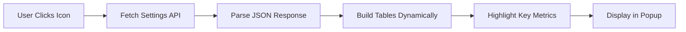

# Universal Limit Tracker Chrome Extension

A Chrome extension to monitor usage limits for APIs and web services (e.g., Grok, Claude, Gemini, DeepSeek) in real-time, with notifications and text-to-speech (TTS) for reading the PRD aloud.

# Perplexity Settings Viewer 🔍

> A lightweight Chrome extension that fetches and displays your **Perplexity AI account settings and usage limits** in a clean, structured dashboard.

[](https://opensource.org/licenses/MIT)
[](https://github.com/Atul8007/Limit_Tracker)

---

## ✨ Overview

Quickly view and compare your Perplexity AI account capabilities including GPT-4 limits, file uploads, storage quotas, and more—all from a convenient browser popup. Perfect for power users who want to track their usage and understand their account limits at a glance.

---

## 🎯 Key Features

| Feature | Description |
|---------|-------------|
| **🔄 Live Data Fetching** | Retrieves your current Perplexity settings in real-time |
| **📊 Visual Dashboard** | Organized tables for account, storage, and API limits |
| **🎨 Smart Highlighting** | Key metrics (GPT-4 quota, uploads) highlighted for quick reference |
| **🔒 Privacy First** | All processing happens locally—no external tracking or data collection |
| **⚡ Lightweight** | Minimal footprint with zero dependencies |

---

## 📦 Installation

### Method 1: Install from Source

1. **Clone the Repository**
   ```bash
   git clone https://github.com/Atul8007/Limit_Tracker.git
   cd Limit_Tracker
   ```

2. **Load in Chrome**
   - Navigate to `chrome://extensions/`
   - Enable **Developer Mode** (toggle in top-right corner)
   - Click **Load unpacked**
   - Select the `Limit_Tracker/Limit_Tracker` folder

3. **Start Using**
   - Click the extension icon in your Chrome toolbar
   - View your Perplexity limits instantly!

### Method 2: Manual Installation

1. Download the [latest release](https://github.com/Atul8007/Limit_Tracker/releases)
2. Extract the ZIP file
3. Follow steps 2-3 from Method 1 above

---

## 🖼️ What You'll See

The extension displays your limits across multiple categories:

### 📋 Account Limits
- **GPT-4 Usage Quota** - Track your advanced model access
- **Alpha/Beta Features** - See enabled experimental features
- **Query Limits** - Daily/monthly search allowances
- **Upload Capabilities** - File upload restrictions

### 💾 Storage & Files
- File count limits
- Maximum file sizes
- Storage quotas

### 🔌 API & Connectors
- Connector access levels
- Repository type restrictions
- API rate limits

---

## 🛠️ Technical Details

### Tech Stack
- **Manifest Version:** Chrome Extension Manifest v3
- **Languages:** Vanilla JavaScript (ES6+), HTML5, CSS3
- **APIs Used:** Chrome Storage API, Chrome Cookies API

### Project Structure
```
Limit_Tracker/
│
├── manifest.json       # Extension configuration
├── popup.html          # Main UI interface
├── popup.js            # Data fetching and rendering logic
├── popup.css           # Styling and layout
├── icon.png            # Extension icon (128x128)
├── icon16.png          # Toolbar icon (16x16)
└── README.md           # Documentation
```

### Required Permissions

```json
{
  "permissions": ["storage", "cookies"],
  "host_permissions": ["https://www.perplexity.ai/rest/user/settings"]
}
```

**Why these permissions?**
- `storage` - Cache your settings locally for faster access
- `cookies` - Authenticate requests to Perplexity's API
- `host_permissions` - Access only the public settings endpoint

---

## 🔧 How It Works



1. **Fetch** - Retrieves data from `https://www.perplexity.ai/rest/user/settings`
2. **Parse** - Extracts account capabilities (limits, quotas, features)
3. **Render** - Dynamically generates organized tables
4. **Highlight** - Emphasizes important metrics for quick scanning

---

## 🚀 Future Enhancements

Contributions welcome! Planned features include:

- [ ] **Historical Tracking** - Compare limits over time
- [ ] **Export Functionality** - Download settings as CSV/JSON
- [ ] **Dark Mode** - Eye-friendly theme option
- [ ] **Multi-Account Support** - Switch between different Perplexity accounts
- [ ] **Usage Alerts** - Notifications when approaching limits
- [ ] **Compact View** - Minimal display mode for small screens

---

## 🤝 Contributing

We welcome contributions! Here's how you can help:

1. **Fork** the repository
2. **Create** a feature branch (`git checkout -b feature/AmazingFeature`)
3. **Commit** your changes (`git commit -m 'Add some AmazingFeature'`)
4. **Push** to the branch (`git push origin feature/AmazingFeature`)
5. **Open** a Pull Request

### Development Setup

```bash
# Clone your fork
git clone https://github.com/YOUR_USERNAME/Limit_Tracker.git

# Create a branch
git checkout -b my-feature

# Make changes and test in Chrome
# Load unpacked extension from chrome://extensions

# Commit and push
git add .
git commit -m "Description of changes"
git push origin my-feature
```

---

## 📄 License

This project is licensed under the **MIT License** - see the [LICENSE](LICENSE) file for details.

```
MIT License

Copyright (c) 2025 Atul Mundakkal

Permission is hereby granted, free of charge, to any person obtaining a copy
of this software and associated documentation files...
```

---

## 🐛 Found a Bug?

Please report issues on our [GitHub Issues](https://github.com/Atul8007/Limit_Tracker/issues) page with:

- Chrome version
- Extension version
- Steps to reproduce
- Expected vs actual behavior
- Screenshots (if applicable)

---

## 👨‍💻 Author

**Atul Mundakkal**

- GitHub: [@Atul8007](https://github.com/Atul8007)
- Project: [Limit_Tracker](https://github.com/Atul8007/Limit_Tracker)

---

## ⭐ Show Your Support

If this extension helped you, please consider:

- ⭐ **Starring** the repository
- 🐦 **Sharing** with others who use Perplexity
- 🤝 **Contributing** improvements or bug fixes

---

## 📚 Disclaimer

This is an **unofficial** tool for personal and educational use. It is not affiliated with, endorsed by, or connected to Perplexity AI. The extension accesses only publicly available user settings data through documented endpoints.

---

<div align="center">

**Made with ❤️ by developers, for developers**

[Report Bug](https://github.com/Atul8007/Limit_Tracker/issues) · [Request Feature](https://github.com/Atul8007/Limit_Tracker/issues) · [Documentation](https://github.com/Atul8007/Limit_Tracker/wiki)

</div>